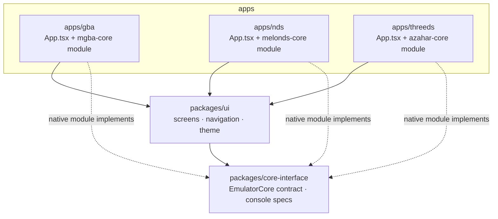

# Emulators

Three Android apps built with Expo + React Native, each emulating classic Nintendo consoles with a different native core:

| App | Consoles | Core |
|---|---|---|
| **gba** | Game Boy, Game Boy Color, Game Boy Advance | [mGBA](https://mgba.io) |
| **nds** | Nintendo DS | [melonDS](https://melonds.kuribo64.net) |
| **threeds** | Nintendo 3DS | [Azahar](https://azahar-emu.org) |

The apps are ~95% the same: ROM library, on-screen controls, savestates, settings. What actually differs is the emulator core underneath and the screen the game renders into. So this is a monorepo — all UI and app logic lives in shared packages, and each app only contributes its native core module and configuration.

## Architecture



- **`packages/core-interface`** — pure TypeScript. The `EmulatorCore` contract every native module implements (load ROM, start/pause, input, savestates, events) plus shared constants: per-console screen sizes, ROM file extensions.
- **`packages/ui`** — everything the user sees: screens, React Navigation stack, theme. It doesn't know which console it's running; each app injects an `AppConfig` (name, console specs, its `core`, its native `EmulatorView`) and renders the shared `<AppRoot />`.
- **`apps/*`** — one Expo project per app. Each contains its emulator core as a local Expo Module (Kotlin, JNI into the C/C++ core). Video never crosses the JS bridge: the core renders straight into a native view.

## Getting started

Requires Node 20+, JDK 17, and the Android SDK.

```sh
npm install            # from the root — installs every workspace

npm run android:gba    # build & install an app on a device/emulator
npm run gba            # start Metro for it (also: nds, threeds)

npm run typecheck      # typecheck all workspaces
```

## Status

Early scaffolding. The shared UI shell, navigation, and the core contract are in place; the Kotlin modules are stubs. JNI integration of the actual cores, the ROM library, the gamepad overlay, and savestate UI are up next.

ROMs are not included and never will be — bring your own legally-obtained dumps.
